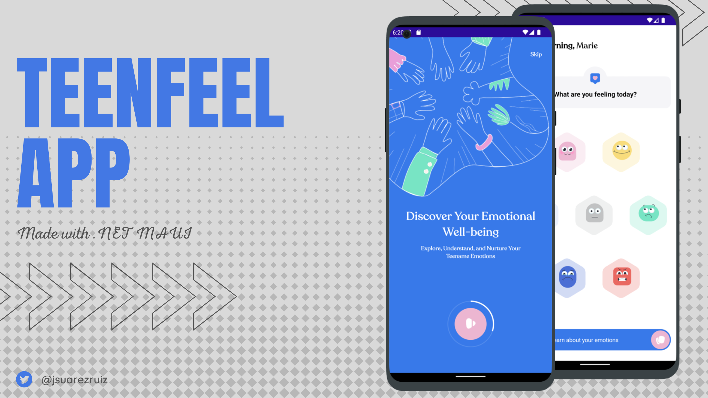

# TeenFeel - .NET MAUI UI Challenge

TeenFeel App UI Challenge made with .NET MAUI.

[Design](https://dribbble.com/shots/22010287-TeenFeel-app-for-the-emotions-understanding) created by K&Z Design

References:
- CircularProgressBar: [Creating a circular progress bar in .NET MAUI](https://mauiblogs.hashnode.dev/creating-a-circular-progress-bar-in-net-maui) by Jasper van den Bergh
- HexLayout: [Xampane](https://github.com/jsuarezruiz/Xampane) by Javier Suarez
- .NET MAUI Compat: https://learn.microsoft.com/en-us/dotnet/maui/migration/custom-renderers